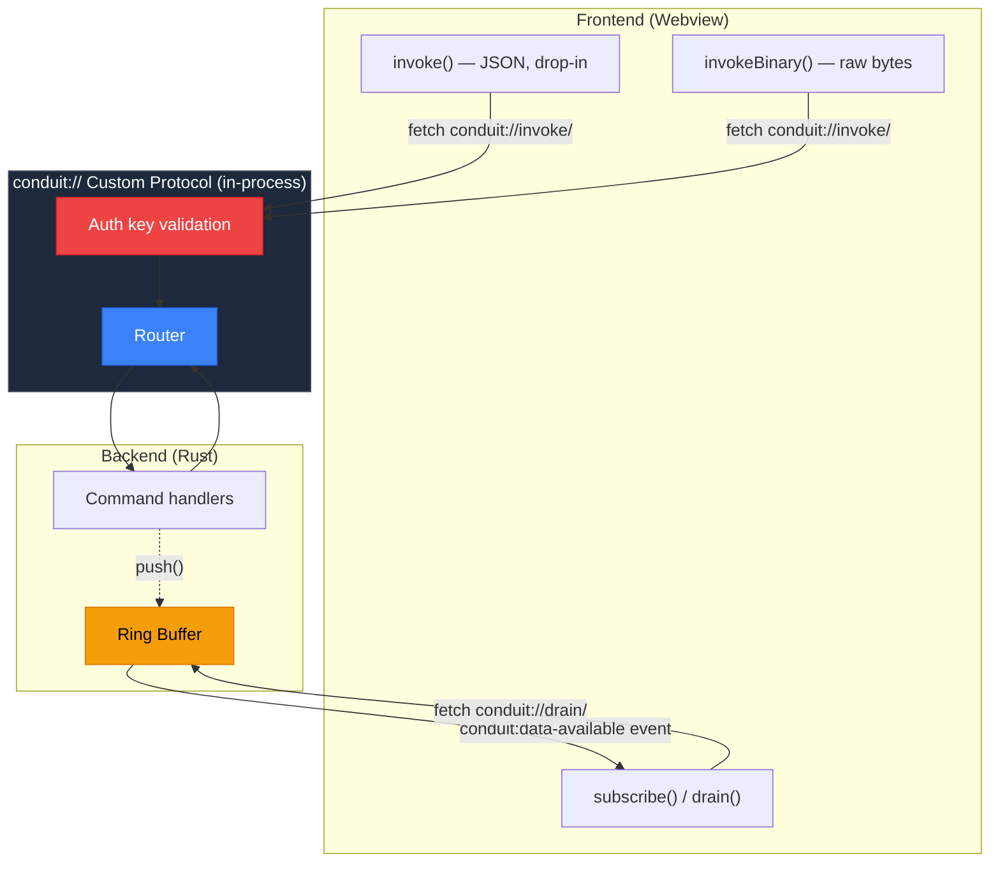
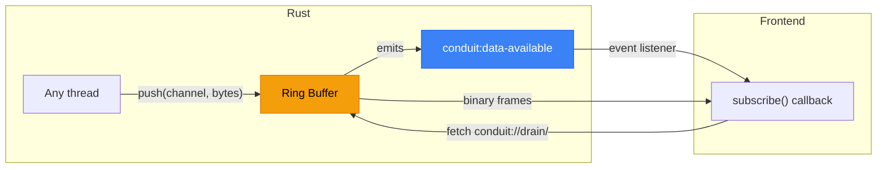
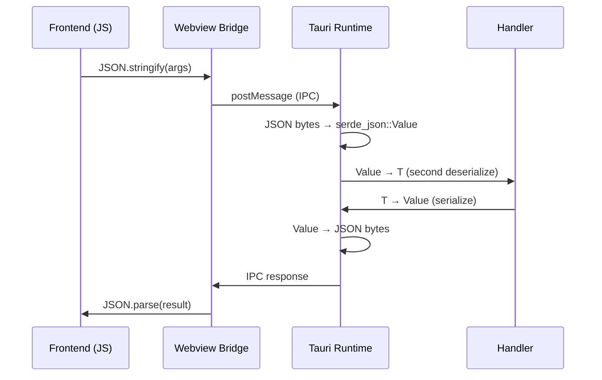
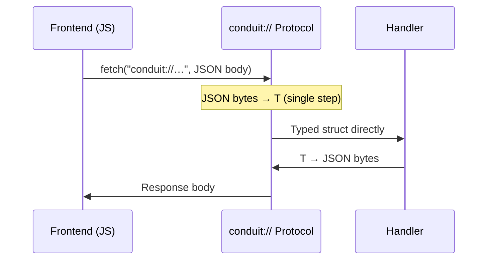
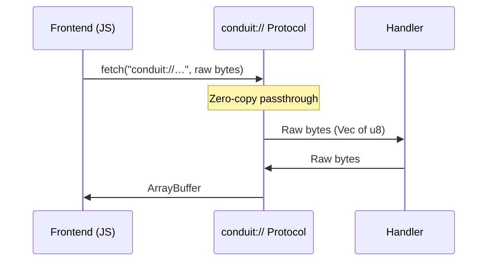

# tauri-conduit

[](https://github.com/userFRM/tauri-conduit/actions/workflows/ci.yml)
[](https://crates.io/crates/tauri-plugin-conduit)
[](https://docs.rs/tauri-plugin-conduit)
[](LICENSE-MIT)
[](https://www.rust-lang.org)

**Binary IPC for Tauri v2 via `conduit://` custom protocol.**

Replaces Tauri's JSON-over-webview IPC with an in-process custom protocol. Level 1 (JSON, drop-in compatible) measures ~2.4x faster. Level 2 (binary) measures up to ~2400x faster on 64 KB payloads.

```diff
- import { invoke } from '@tauri-apps/api/core';
+ import { invoke } from 'tauri-plugin-conduit';
```

---

## Architecture



---

## When this is useful

For apps where IPC is not on the critical path (button clicks, form submissions, occasional data fetches), Tauri's built-in `invoke()` is sufficient.

conduit targets apps where IPC throughput matters: streaming real-time data, processing binary buffers per-frame, or ingesting high-frequency telemetry. In these cases, the serialization and bridge overhead becomes measurable.

## Two levels of optimization

conduit provides two optimization tiers. Level 1 is a drop-in replacement. Level 2 eliminates JSON entirely.

### Level 1: Drop-in replacement -- ~2.4x faster

`invoke()` is API-compatible with Tauri's built-in invoke. It still uses JSON for argument encoding, but routes through conduit's in-process custom protocol and deserializes directly to the target type (skipping the intermediate `serde_json::Value` conversion). Measured at ~2.4x faster across tested payload sizes.

```typescript
import { invoke } from 'tauri-plugin-conduit';

// Same API as Tauri's invoke()
const result = await invoke('get_ticks', { symbol: 'AAPL' });
```

| Payload | Tauri invoke | conduit invoke | Improvement |
|---|---|---|---|
| 25B struct | 762 ns | 316 ns | **2.4x faster** |
| 1 KB | 34 us | 14.7 us | **2.3x faster** |
| 64 KB | 2.16 ms | 867 us | **2.5x faster** |

### Level 2: Binary mode -- up to ~2400x faster

`invokeBinary()` eliminates JSON entirely -- raw bytes in, raw bytes out. The improvement scales with payload size.

```typescript
import { connect } from 'tauri-plugin-conduit';

const conduit = await connect();
const buf = await conduit.invokeBinary('raw_data', new Uint8Array([1, 2, 3]));
```

| Payload | Tauri invoke | conduit binary | Improvement |
|---|---|---|---|
| 25B struct | 762 ns | 76 ns | **10x faster** |
| 1 KB | 34 us | 68 ns | **500x faster** |
| 64 KB | 2.16 ms | 893 ns | **2400x faster** |

### The full picture

All three paths side by side.

| Payload | Tauri invoke | Level 1 (drop-in) | Level 2 (binary) |
|---|---|---|---|
| 25B struct | 762 ns | 316 ns (2.4x) | 76 ns (10x) |
| 1 KB | 34 us | 14.7 us (2.3x) | 68 ns (500x) |
| 64 KB | 2.16 ms | 867 us (2.5x) | 893 ns (2400x) |

> Measured with criterion on the Rust dispatch layer. Run `cd crates/conduit-core && cargo bench -- comparison` to see numbers on your hardware.

## Getting Started

### 1. Install

```sh
# Rust (in your src-tauri directory)
cargo add tauri-plugin-conduit

# TypeScript
npm install tauri-plugin-conduit
```

### 2. Register your commands (Rust)

Use `#[command]` for Tauri-style named parameters:

```rust
use tauri_plugin_conduit::command;

#[command]
fn get_ticks(symbol: String, limit: u32) -> Vec<Tick> {
    db::query_ticks(&symbol, limit)
}

#[command]
fn place_order(symbol: String, qty: f64) -> Result<OrderId, String> {
    broker::submit(&symbol, qty).map_err(|e| e.to_string())
}
```

Register handlers in your Tauri builder:

```rust
// src-tauri/src/main.rs
tauri::Builder::default()
    .plugin(
        tauri_plugin_conduit::init()
            .command_json("get_ticks", get_ticks)
            .command_json_result("place_order", place_order)
            .channel("telemetry")
            .channel_ordered("events")
            .build()
    )
    .run(tauri::generate_context!())
    .unwrap();
```

Four handler registration methods are available:
- `command_json(name, handler)` -- JSON in, JSON out. Pair with `#[command]` for named parameters.
- `command_json_result(name, handler)` -- same as above, but the handler returns `Result<R, E>`. Errors are propagated to the caller.
- `command_binary(name, handler)` -- binary in, binary out. The handler takes a type implementing `Decode` and returns a type implementing `Encode`. No JSON involved.
- `command(name, handler)` -- raw `Vec<u8>` in, `Vec<u8>` out. Full control, no automatic (de)serialization.

### 3. Call from the frontend

```typescript
import { invoke } from 'tauri-plugin-conduit';

const result = await invoke('get_ticks', { symbol: 'AAPL' });
```

## Streaming

conduit includes built-in streaming from Rust to JavaScript via ring buffers and Tauri events.

Two channel types are available:

- **`channel(name)`** -- lossy. When the buffer is full, the oldest frames are silently dropped. Use for telemetry, game state, and real-time data where freshness matters more than completeness.
- **`channel_ordered(name)`** -- ordered, no drops. When the buffer is full, `push()` returns an error (backpressure). Use for transaction logs, control messages, and data that must arrive intact and in order.

Both types default to 64 KB capacity. Use `channel_with_capacity()` or `channel_ordered_with_capacity()` to override.

**Rust side** -- register channels and push data:

```rust
tauri_plugin_conduit::init()
    .channel("telemetry")               // lossy streaming channel
    .channel_ordered("events")          // ordered, no-drop channel
    .build()

// Later, from any thread:
let state: tauri::State<'_, tauri_plugin_conduit::PluginState<R>> = app.state();
state.push("telemetry", &bytes)?;       // auto-notifies the frontend
```

**JS side** -- subscribe for automatic delivery, or pull manually:

```typescript
// Option A: automatic (no polling, event-driven)
const unsub = await subscribe('telemetry', (buf) => {
  // Called each time Rust pushes data
});

// Option B: manual (pull whenever you want)
const buf = await drain('telemetry');
```

Under the hood, Rust writes frames into a ring buffer and emits a `conduit:data-available` event. The JS client listens for the event and fetches data through the custom protocol. Behavior when the buffer is full depends on the channel type: lossy channels drop the oldest frames; ordered channels return an error to the producer.



## How it works

conduit registers a `conduit://` custom protocol with Tauri. When your frontend calls `invoke()`, it uses `fetch("conduit://...")` instead of going through the webview message bridge. The request stays in the same process -- no network, no IPC pipes.

### Tauri's built-in IPC path



### conduit Level 1 (drop-in) -- same JSON, fewer steps



### conduit Level 2 (binary) -- no JSON anywhere



**Why Level 1 is faster even though it still uses JSON:** Tauri's built-in invoke deserializes JSON into an intermediate `serde_json::Value`, then converts that Value into your typed struct -- two deserialization steps. conduit uses [sonic-rs](https://github.com/cloudwego/sonic-rs) (SIMD-accelerated JSON) to deserialize directly from bytes to the target struct in one step, and routes through an in-process custom protocol instead of the webview message bridge.

| | Tauri `invoke()` | conduit `invoke()` | conduit `invokeBinary()` |
|---|---|---|---|
| **Transport** | Webview bridge | Custom protocol (in-process) | Custom protocol (in-process) |
| **Rust-side JSON** | serde_json: bytes -> Value -> T (double parse) | sonic-rs: bytes -> T (single parse, SIMD) | No JSON |
| **Handler registration** | `#[tauri::command]`: named params, `State<T>`, `Result<T,E>`, async | `#[command]` + `command_json`: named params, `Result<T,E>`, sync only, no `State<T>` | `command_binary(name, fn)`: Encode/Decode types, sync only |
| **Streaming** | Manual event wiring | Built-in push + drain (lossy and ordered) | Built-in push + drain (lossy and ordered) |
| **Network surface** | None | None | None |

## Typed binary codec (optional)

For binary mode, conduit provides derive macros to define compact binary formats. This is entirely optional -- `invoke()` works without it.

```rust
use conduit_derive::{Encode, Decode};

#[derive(Encode, Decode)]
struct MarketTick {
    timestamp: i64,
    price: f64,
    volume: f64,
    side: u8,
}
// 25 bytes on the wire. No schema, no parsing.
```

Supported types: `u8`-`u64`, `i8`-`i64`, `f32`, `f64`, `bool`, `Vec<u8>`, `String`.

## Security

Everything runs in-process -- no ports, no sockets, no network endpoints.

- **Per-launch auth key** -- a random 32-byte key is generated each time your app starts. Every request is validated with constant-time comparison. Leaked keys expire when the app restarts.
- **Tauri permissions** -- integrates with Tauri's built-in capability system for command authorization.
- **CSP safe** -- no Content Security Policy exceptions required.
- **Panic isolation** -- if a handler panics, conduit catches it and returns a clean error. The app keeps running.

## Tradeoffs

conduit is not a free lunch. These are real costs you should weigh before adopting it.

**Handler ergonomics.** conduit provides `#[command]` for named parameters and `Result<T, E>` returns -- similar to `#[tauri::command]`. However, conduit handlers are synchronous only (no async) and do not support `State<T>` injection. If you need managed state, pass it through your handler manually.

**Streaming tradeoffs.** Lossy channels (`channel()`) drop the oldest frames when the consumer falls behind. Ordered channels (`channel_ordered()`) never drop frames but return an error when full (backpressure). Neither channel type provides at-least-once or exactly-once delivery guarantees across reconnects.

**Binary mode trades debuggability for speed.** JSON is human-readable -- you can inspect it in devtools, log it, diff it. Raw bytes are opaque. Level 2 makes production debugging harder. Use it on hot paths where the performance difference justifies the loss of visibility.

**Dependency risk.** conduit relies on Tauri's `register_uri_scheme_protocol` API. If Tauri makes breaking changes to custom protocol internals, conduit needs to be updated before your app can upgrade. This is a real coupling that Tauri's built-in IPC doesn't have.

**When to just use Tauri's built-in IPC:** If your app is mostly UI-driven (button clicks, form submissions, occasional data fetches), Tauri's invoke is sufficient. conduit is for the cases where IPC is measurably on your critical path.

## Project layout

```
tauri-conduit/
  crates/
    conduit-core/              Core library (codec, router, ring buffer)
    conduit-derive/            Proc macros (Encode, Decode, #[command])
    tauri-plugin-conduit/      Tauri v2 plugin
  packages/
    tauri-plugin-conduit/      TypeScript client (tauri-plugin-conduit)
```

## Contributing

Contributions welcome. Run the test suite before submitting:

```sh
cargo test --workspace
cargo clippy --workspace
```

## License

Licensed under either of [MIT](LICENSE-MIT) or [Apache 2.0](LICENSE-APACHE) at your option.
