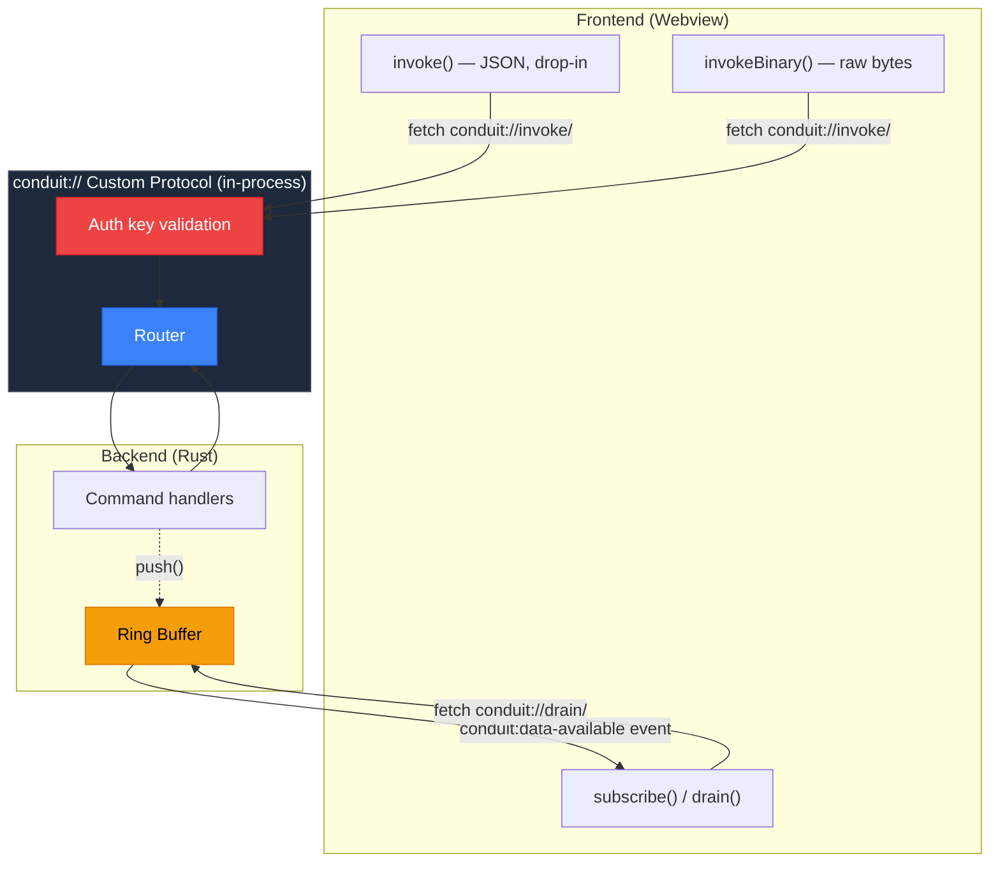
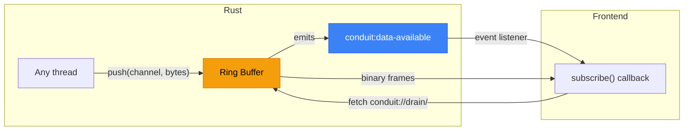
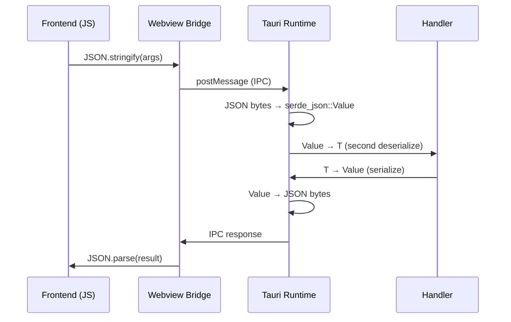
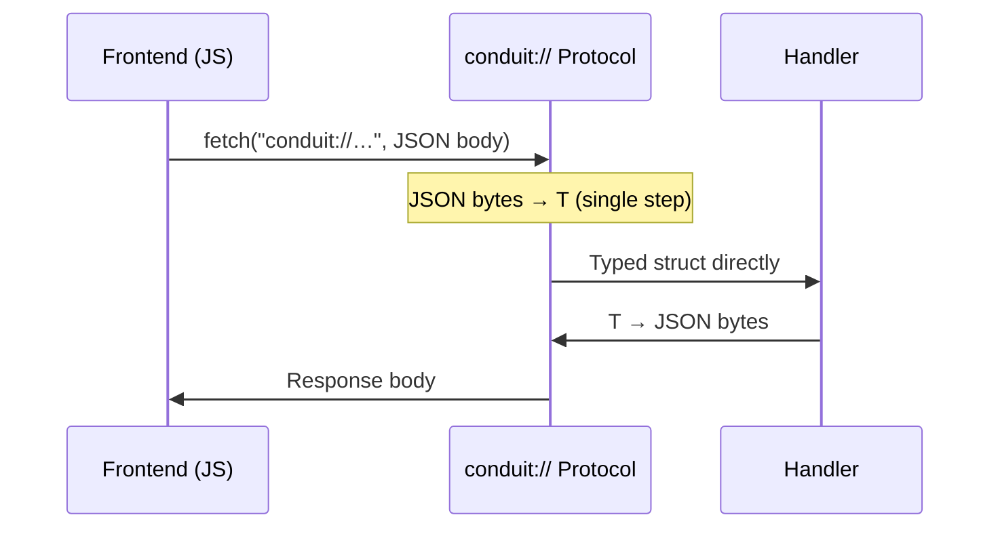
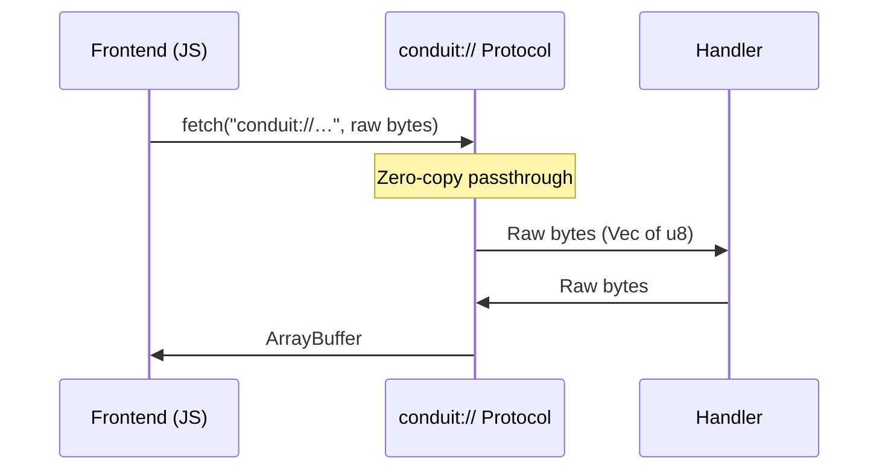

# tauri-conduit

[](https://github.com/userFRM/tauri-conduit/actions/workflows/ci.yml)
[](https://crates.io/crates/tauri-plugin-conduit)
[](https://docs.rs/tauri-plugin-conduit)
[](LICENSE-MIT)
[](https://www.rust-lang.org)

**A faster drop-in replacement for Tauri's `invoke()`.**

Swap one import and your Tauri v2 app gets **2.4x faster IPC** through an in-process custom protocol. Go further with binary mode for up to **2400x faster** on large payloads.

```diff
- import { invoke } from '@tauri-apps/api/core';
+ import { invoke } from 'tauri-plugin-conduit';
```

---

## Architecture



---

## "Does a Tauri app really need this?"

If your app sends a button click and gets a string back, probably not -- Tauri's built-in IPC is fine for that.

But Tauri is increasingly used for apps where performance actually matters: trading terminals streaming real-time market data, audio/video tools processing buffers every frame, IoT dashboards ingesting sensor telemetry, game overlays syncing state at 60+ fps. In these cases, the IPC layer between your frontend and backend becomes the bottleneck -- not Rust, not your logic, just the bridge.

conduit exists so you don't have to choose between Tauri's developer experience and the performance your use case demands.

## Two levels of optimization

conduit gives you a progressive optimization path -- start easy, go deeper where it matters.

### Level 1: Drop-in replacement -- 2.4x faster

Change one import. Your existing code keeps working.

`invoke()` is API-compatible with Tauri's built-in invoke. It still uses JSON for argument encoding, but routes through conduit's in-process custom protocol and skips Tauri's intermediate `serde_json::Value` conversion. The result: **~2.4x faster** across all payload sizes, with zero code changes.

```typescript
import { invoke } from 'tauri-plugin-conduit';

// Same API you already know from Tauri
const result = await invoke('get_ticks', { symbol: 'AAPL' });
```

| Payload | Tauri invoke | conduit invoke | Improvement |
|---|---|---|---|
| 25B struct | 762 ns | 316 ns | **2.4x faster** |
| 1 KB | 34 us | 14.7 us | **2.3x faster** |
| 64 KB | 2.16 ms | 867 us | **2.5x faster** |

### Level 2: Binary mode -- up to 2400x faster

For hot paths where every microsecond counts, switch to `invokeBinary()`. This eliminates JSON entirely -- raw bytes in, raw bytes out. The larger the payload, the bigger the win.

```typescript
import { connect } from 'tauri-plugin-conduit';

const conduit = await connect();
const buf = await conduit.invokeBinary('raw_data', new Uint8Array([1, 2, 3]));
```

| Payload | Tauri invoke | conduit binary | Improvement |
|---|---|---|---|
| 25B struct | 762 ns | 76 ns | **10x faster** |
| 1 KB | 34 us | 68 ns | **500x faster** |
| 64 KB | 2.16 ms | 893 ns | **2400x faster** |

### The full picture

All three paths side by side. Level 1 is free performance. Level 2 is for when you need it.

| Payload | Tauri invoke | Level 1 (drop-in) | Level 2 (binary) |
|---|---|---|---|
| 25B struct | 762 ns | 316 ns (2.4x) | 76 ns (10x) |
| 1 KB | 34 us | 14.7 us (2.3x) | 68 ns (500x) |
| 64 KB | 2.16 ms | 867 us (2.5x) | 893 ns (2400x) |

> Measured with criterion on the Rust dispatch layer. Run `cd crates/conduit-core && cargo bench -- comparison` to see numbers on your hardware.

## Getting Started

### 1. Install

```sh
# Rust (in your src-tauri directory)
cargo add tauri-plugin-conduit

# TypeScript
npm install tauri-plugin-conduit
```

### 2. Register your commands (Rust)

```rust
// src-tauri/src/main.rs
tauri::Builder::default()
    .plugin(
        tauri_plugin_conduit::init()
            .command("ping", |_| b"pong".to_vec())
            .command("get_ticks", handle_ticks)
            .build()
    )
    .run(tauri::generate_context!())
    .unwrap();
```

Commands receive raw bytes (`Vec<u8>`) and return raw bytes. For JSON-style usage, deserialize the payload in your handler. For binary mode, use the codec directly.

### 3. Call from the frontend

```typescript
import { invoke } from 'tauri-plugin-conduit';

const result = await invoke('get_ticks', { symbol: 'AAPL' });
```

## Streaming

conduit includes built-in streaming from Rust to JavaScript with no polling required.

**Rust side** -- register a channel and push data to it:

```rust
tauri_plugin_conduit::init()
    .channel("telemetry")               // register a streaming channel
    .build()

// Later, from any thread:
let state: tauri::State<'_, tauri_plugin_conduit::PluginState<R>> = app.state();
state.push("telemetry", &bytes)?;       // auto-notifies the frontend
```

**JS side** -- subscribe for automatic delivery, or pull manually:

```typescript
// Option A: automatic (no polling, event-driven)
const unsub = await subscribe('telemetry', (buf) => {
  // Called each time Rust pushes data
});

// Option B: manual (pull whenever you want)
const buf = await drain('telemetry');
```

Under the hood, Rust writes frames into a ring buffer and emits a lightweight event. The JS client listens for the event and fetches the data through the custom protocol. If the consumer falls behind, the oldest frames are dropped -- latest data always wins, and the producer never blocks.



## How it works

conduit registers a `conduit://` custom protocol with Tauri. When your frontend calls `invoke()`, it uses `fetch("conduit://...")` instead of going through the webview message bridge. The request stays in the same process -- no network, no IPC pipes.

### Tauri's built-in IPC path



### conduit Level 1 (drop-in) -- same JSON, fewer steps



### conduit Level 2 (binary) -- no JSON anywhere



**Why Level 1 is faster even though it still uses JSON:** Tauri's built-in invoke deserializes your JSON into an intermediate `serde_json::Value`, then converts that Value into your typed struct -- two steps. conduit skips the middleman and deserializes directly from JSON bytes to your struct in one step. That alone cuts the overhead in half.

| | Tauri `invoke()` | conduit `invoke()` | conduit `invokeBinary()` |
|---|---|---|---|
| **Transport** | Webview bridge | Custom protocol (in-process) | Custom protocol (in-process) |
| **Rust-side JSON** | bytes -> Value -> T (double parse) | bytes -> T (single parse) | No JSON |
| **Streaming** | Manual event wiring | Built-in push + drain | Built-in push + drain |
| **Network surface** | None | None | None |

## Typed binary codec (optional)

For binary mode, conduit provides derive macros to define compact binary formats. This is entirely optional -- `invoke()` works without it.

```rust
use conduit_derive::{Encode, Decode};

#[derive(Encode, Decode)]
struct MarketTick {
    timestamp: i64,
    price: f64,
    volume: f64,
    side: u8,
}
// 25 bytes on the wire. No schema, no parsing.
```

Supported types: `u8`-`u64`, `i8`-`i64`, `f32`, `f64`, `bool`, `Vec<u8>`, `String`.

## Security

Everything runs in-process -- no ports, no sockets, no network endpoints.

- **Per-launch auth key** -- a random 32-byte key is generated each time your app starts. Every request is validated with constant-time comparison. Leaked keys expire when the app restarts.
- **Tauri permissions** -- integrates with Tauri's built-in capability system for command authorization.
- **CSP safe** -- no Content Security Policy exceptions required.
- **Panic isolation** -- if a handler panics, conduit catches it and returns a clean error. The app keeps running.

## Project layout

```
tauri-conduit/
  crates/
    conduit-core/              Core library (codec, router, ring buffer)
    conduit-derive/            Derive macros (Encode, Decode)
    tauri-plugin-conduit/      Tauri v2 plugin
  packages/
    tauri-plugin-conduit/      TypeScript client (tauri-plugin-conduit)
```

## Contributing

Contributions welcome. Run the test suite before submitting:

```sh
cargo test --workspace
cargo clippy --workspace
```

## License

Licensed under either of [MIT](LICENSE-MIT) or [Apache 2.0](LICENSE-APACHE) at your option.
