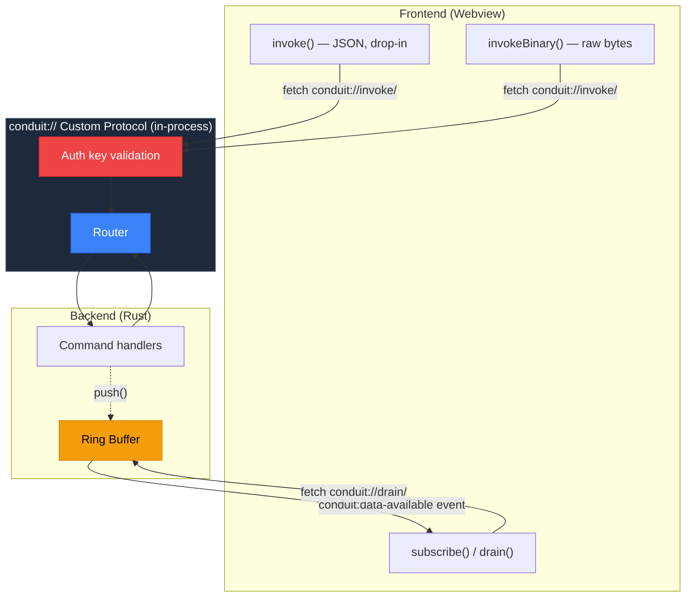
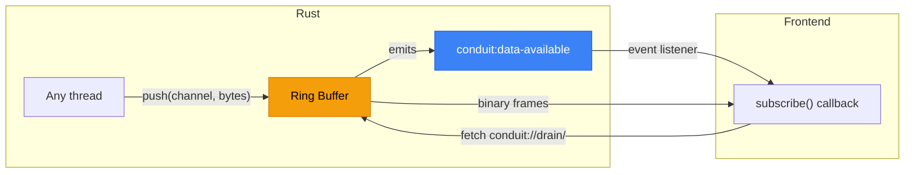
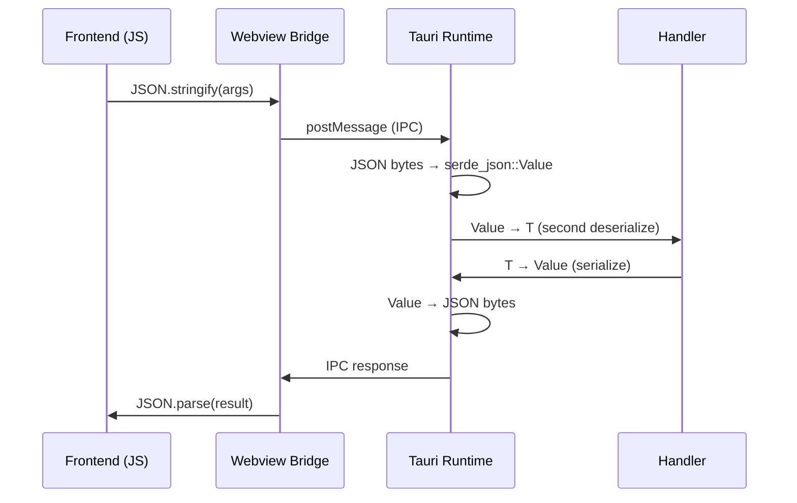
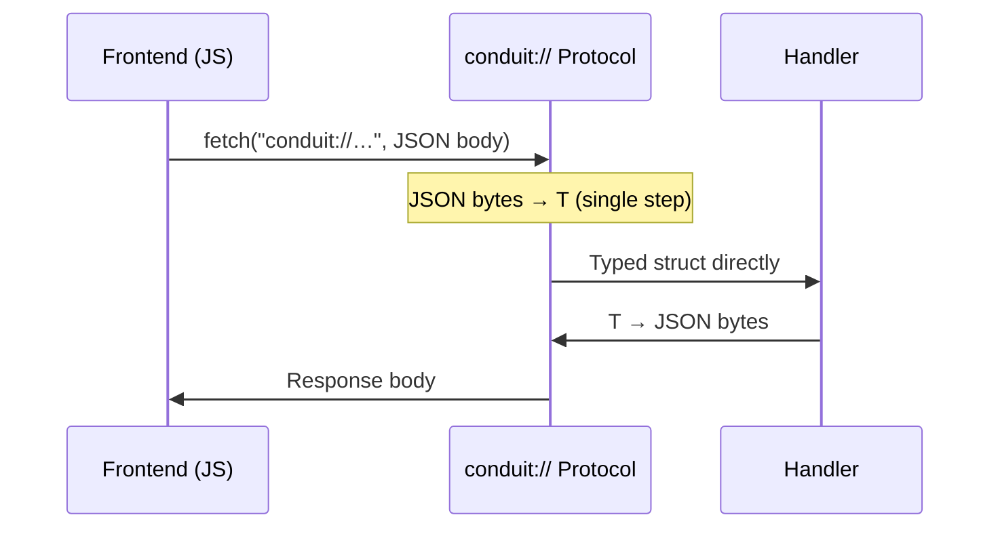
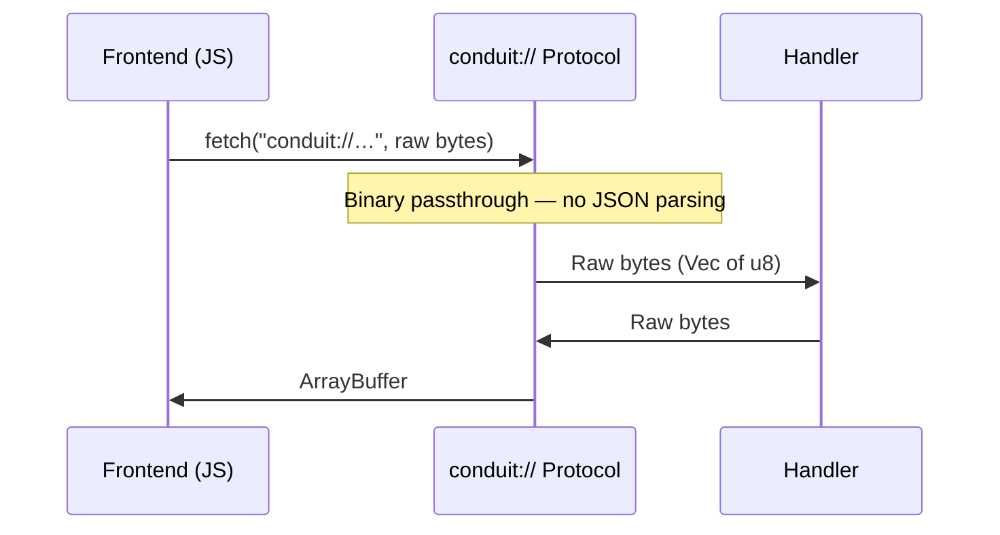

# tauri-conduit

[](https://github.com/userFRM/tauri-conduit/actions/workflows/ci.yml)
[](https://crates.io/crates/tauri-plugin-conduit)
[](https://docs.rs/tauri-plugin-conduit)
[](LICENSE-MIT)
[](https://www.rust-lang.org)

**Binary IPC for Tauri v2 via `conduit://` custom protocol.**

Replaces Tauri's JSON-over-webview IPC with an in-process custom protocol. Level 1 (JSON, drop-in compatible) measures ~2.1-2.8x faster Rust-side dispatch. Level 2 (binary) measures up to ~500x faster Rust-side dispatch on 64 KB payloads.

```diff
- import { invoke } from '@tauri-apps/api/core';
+ import { invoke } from 'tauri-plugin-conduit';
```

---

## Architecture



---

## When this is useful

For apps where IPC is not on the critical path (button clicks, form submissions, occasional data fetches), Tauri's built-in `invoke()` is sufficient.

conduit targets apps where IPC throughput matters: streaming real-time data, processing binary buffers per-frame, or ingesting high-frequency telemetry. In these cases, the serialization and bridge overhead becomes measurable.

## Two levels of optimization

conduit provides two optimization tiers. Level 1 is a drop-in replacement. Level 2 eliminates JSON entirely.

> **All numbers are Rust dispatch layer only** -- excludes WebView bridge, `fetch()`, and JS parsing overhead. See [BENCHMARKS.md](BENCHMARKS.md) for methodology and full results.

### Level 1: Drop-in replacement -- ~2-3x faster Rust-side dispatch

`invoke()` is API-compatible with Tauri's built-in invoke. It still uses JSON for argument encoding, but routes through conduit's in-process custom protocol and deserializes directly to the target type (skipping the intermediate `serde_json::Value` conversion). conduit uses sonic-rs for JSON deserialization at both Level 1 and Level 2, while Tauri uses serde_json with an intermediate `Value` step.

```typescript
import { invoke } from 'tauri-plugin-conduit';

// Same API as Tauri's invoke()
const result = await invoke('get_ticks', { symbol: 'AAPL' });
```

| Payload | Tauri invoke | conduit invoke | Improvement |
|---|---|---|---|
| 25B struct | 714 ns | 333 ns | **~2.1x faster Rust-side dispatch** |
| 1 KB | 8.5 us | 7.6 us | **~1.1x faster Rust-side dispatch** |
| 64 KB | 2.30 ms | 821 us | **~2.8x faster Rust-side dispatch** |

### Level 2: Binary mode -- up to ~500x faster Rust-side dispatch

`invokeBinary()` eliminates JSON entirely -- raw bytes in, raw bytes out. Binary passthrough -- no JSON parsing. The improvement scales with payload size.

```typescript
import { connect } from 'tauri-plugin-conduit';

const conduit = await connect();
const buf = await conduit.invokeBinary('raw_data', new Uint8Array([1, 2, 3]));
```

| Payload | Tauri invoke | conduit binary | Improvement |
|---|---|---|---|
| 25B struct | 714 ns | 78 ns | **~9x faster Rust-side dispatch** |
| 1 KB | 8.5 us | 991 ns | **~8.6x faster Rust-side dispatch** |
| 64 KB | 2.30 ms | 4.6 us | **~500x faster Rust-side dispatch** |

### The full picture

All three paths side by side.

| Payload | Tauri invoke | Level 1 (drop-in) | Level 2 (binary) |
|---|---|---|---|
| 25B struct | 714 ns | 333 ns (~2.1x) | 78 ns (~9x) |
| 1 KB | 8.5 us | 7.6 us (~1.1x) | 991 ns (~8.6x) |
| 64 KB | 2.30 ms | 821 us (~2.8x) | 4.6 us (~500x) |

> Measured with criterion on the Rust dispatch layer. The 1KB payload uses a complex mixed type (nested strings, float arrays); simpler payloads see larger improvements. Run `cd crates/conduit-core && cargo bench -- comparison` to see numbers on your hardware.

## Getting Started

### 1. Install

```sh
# Rust (in your src-tauri directory)
cargo add tauri-plugin-conduit

# TypeScript
npm install tauri-plugin-conduit
```

### 2. Register your commands (Rust)

Use `#[tauri_conduit::command]` for named parameters, `State<T>`/`AppHandle`/`Window`/`Webview` injection, `Result<T, E>` returns, and async:

```rust
use tauri_conduit::command;
use tauri::State;

struct AppState { app_name: String }

#[command]
fn get_ticks(symbol: String, limit: u32) -> Vec<Tick> {
    db::query_ticks(&symbol, limit)
}

#[command]
fn place_order(state: State<'_, AppState>, symbol: String, qty: f64) -> Result<OrderId, String> {
    broker::submit(&state.app_name, &symbol, qty).map_err(|e| e.to_string())
}

#[command]
async fn fetch_data(url: String) -> Result<Vec<u8>, String> {
    reqwest::get(&url).await.map_err(|e| e.to_string())?
        .bytes().await.map(|b| b.to_vec()).map_err(|e| e.to_string())
}
```

Register handlers in your Tauri builder using `handler!()` to resolve command functions:

```rust
// src-tauri/src/main.rs
use tauri_conduit::handler;

tauri::Builder::default()
    .plugin(
        tauri_plugin_conduit::init()
            .handler("get_ticks", handler!(get_ticks))
            .handler("place_order", handler!(place_order))
            .handler("fetch_data", handler!(fetch_data))
            .channel("telemetry")
            .channel_ordered("events")
            .build()
    )
    .run(tauri::generate_context!())
    .unwrap();
```

Six handler registration methods are available:
- `handler(name, handler)` -- **recommended.** Use with `#[tauri_conduit::command]` + `handler!()`. Supports named parameters, `State<T>`, `AppHandle`, `Window`/`WebviewWindow`, `Webview` injection, `Result<T, E>`, and async. Full `#[tauri::command]` parity.
- `handler_raw(name, closure)` -- legacy closure-based handler (`Fn(Vec<u8>, &dyn Any) -> Result<Vec<u8>, Error>`). Use for backward compatibility when migrating from v1.
- `command_json(name, handler)` -- JSON in, JSON out. Single argument type (no named parameters, no State, no async).
- `command_json_result(name, handler)` -- same as above, but the handler returns `Result<R, E>`. Errors are propagated to the caller.
- `command_binary(name, handler)` -- binary in, binary out. The handler takes a type implementing `Decode` and returns a type implementing `Encode`. No JSON involved.
- `command(name, handler)` -- raw `Vec<u8>` in, `Vec<u8>` out. Full control, no automatic (de)serialization.

### 3. Call from the frontend

```typescript
import { invoke } from 'tauri-plugin-conduit';

const result = await invoke('get_ticks', { symbol: 'AAPL' });
```

### Parameter naming

Like Tauri's `#[tauri::command]`, tauri-conduit's `#[command]` macro automatically converts Rust snake_case parameter names to camelCase in JSON. A Rust parameter `user_name: String` is passed as `{ userName: "Alice" }` from JavaScript.

## Streaming

conduit includes built-in streaming from Rust to JavaScript via ring buffers and Tauri events.

> **Note:** The default `.channel("name")` creates a **lossy** ring buffer -- oldest frames are silently dropped when the buffer is full. Use `.channel_ordered("name")` for guaranteed-delivery ordered channels (backed by an unbounded queue -- monitor memory usage).

Two channel types are available:

- **`channel(name)`** -- lossy. When the buffer is full, the oldest frames are silently dropped. Use for telemetry, game state, and real-time data where freshness matters more than completeness.
- **`channel_ordered(name)`** -- ordered, no drops. When the buffer is full, `push()` returns an error (backpressure). Use for transaction logs, control messages, and data that must arrive intact and in order.

Both types default to 64 KB capacity. Use `channel_with_capacity()` or `channel_ordered_with_capacity()` to override.

**Rust side** -- register channels and push data:

```rust
tauri_plugin_conduit::init()
    .channel("telemetry")               // lossy streaming channel
    .channel_ordered("events")          // ordered, no-drop channel
    .build()

// Later, from any thread:
let state: tauri::State<'_, tauri_plugin_conduit::PluginState<R>> = app.state();
state.push("telemetry", &bytes)?;       // auto-notifies the frontend
```

**JS side** -- subscribe for automatic delivery, or pull manually:

```typescript
// Option A: automatic (no polling, event-driven)
const unsub = await subscribe('telemetry', (buf) => {
  // Called each time Rust pushes data
});

// Option B: manual (pull whenever you want)
const buf = await drain('telemetry');
```

Under the hood, Rust writes frames into a ring buffer and emits a `conduit:data-available` event. The JS client listens for the event and fetches data through the custom protocol. Behavior when the buffer is full depends on the channel type: lossy channels drop the oldest frames; ordered channels return an error to the producer.



## How it works

conduit registers a `conduit://` custom protocol with Tauri. When your frontend calls `invoke()`, it uses `fetch("conduit://...")` instead of going through the webview message bridge. The request stays in the same process -- no network, no IPC pipes.

### Tauri's built-in IPC path



### conduit Level 1 (drop-in) -- same JSON, fewer steps



### conduit Level 2 (binary) -- no JSON anywhere



**Why Level 1 is faster even though it still uses JSON:** Tauri's built-in invoke deserializes JSON into an intermediate `serde_json::Value`, then converts that Value into your typed struct -- two deserialization steps. conduit uses [sonic-rs](https://github.com/cloudwego/sonic-rs) (SIMD-accelerated JSON) to deserialize directly from bytes to the target struct in one step, and routes through an in-process custom protocol instead of the webview message bridge.

| | Tauri `invoke()` | conduit `invoke()` | conduit `invokeBinary()` |
|---|---|---|---|
| **Transport** | Webview bridge | Custom protocol (in-process) | Custom protocol (in-process) |
| **Rust-side JSON** | serde_json: bytes -> Value -> T (double parse) | sonic-rs: bytes -> T (single parse, SIMD) | No JSON |
| **Handler registration** | `#[tauri::command]`: named params, `State<T>`, `Result<T,E>`, async | `#[tauri_conduit::command]` + `handler!()`: named params, `State<T>`, `AppHandle`, `Window`/`Webview`, `Result<T,E>`, sync + async (tokio-spawned) | `command_binary(name, fn)`: Encode/Decode types, sync only |
| **Streaming** | Manual event wiring | Built-in push + drain (lossy and ordered) | Built-in push + drain (lossy and ordered) |
| **Network surface** | None | None | None |

## Typed binary codec (optional)

For binary mode, conduit provides derive macros to define compact binary formats. This is entirely optional -- `invoke()` works without it.

```rust
use conduit_derive::{Encode, Decode};

#[derive(Encode, Decode)]
struct MarketTick {
    timestamp: i64,
    price: f64,
    volume: f64,
    side: u8,
}
// 25 bytes on the wire. No schema, no parsing.
```

Supported types: `u8`-`u64`, `i8`-`i64`, `f32`, `f64`, `bool`, `Vec<u8>`, `String`.

## Security

Everything runs in-process -- no ports, no sockets, no network endpoints.

- **Authentication** -- conduit uses a per-launch 32-byte invoke key (constant-time validated) as its access control mechanism. This is simpler than Tauri's per-command ACL: any webview with the invoke key can call any registered command. For multi-window apps requiring granular per-command access control, stick with Tauri's built-in IPC.
- **CSP safe** -- no Content Security Policy exceptions required.
- **Panic isolation** -- if a handler panics, conduit catches it and returns a clean error. The app keeps running.

**Threat model**: The invoke key protects against cross-origin requests (other tabs, browser extensions intercepting network requests). It does **not** protect against malicious JavaScript running in the same WebView context -- any JS with access to the page can obtain the key via `fetch()` interception or DevTools. This matches Tauri's own trust model: the WebView JS context is trusted. Disable DevTools in production builds.

## Differences from Tauri's built-in IPC

Level 1 is a drop-in replacement — change one import and you're done. `#[tauri_conduit::command]` has full parity with `#[tauri::command]`: named parameters (camelCase conversion included), `State<T>`, `AppHandle`, `Window`/`Webview` injection, async, and `Result<T, E>`.

For streaming, conduit provides high-throughput ring buffer channels (`subscribe()`/`drain()`). For per-invocation progress callbacks, use `AppHandle::emit()` directly — handlers have full access to Tauri's event system via `AppHandle` injection.

## Project layout

```
tauri-conduit/
  crates/
    conduit/                   Facade crate (re-exports #[command], Encode, Decode)
    conduit-core/              Core library (codec, router, ring buffer)
    conduit-derive/            Proc macros (Encode, Decode, #[command])
    tauri-plugin-conduit/      Tauri v2 plugin
  packages/
    tauri-plugin-conduit/      TypeScript client (tauri-plugin-conduit)
```

The `tauri-conduit` facade crate (6 lines) exists solely to enable the `#[tauri_conduit::command]` attribute path. It re-exports the proc macro and core types.

### Testing

```sh
cargo test --workspace                                    # core + derive crates
cargo test --manifest-path crates/tauri-plugin-conduit/Cargo.toml  # plugin unit tests
cd packages/tauri-plugin-conduit && npx tsx --test src/__tests__/*.test.ts  # TS codec tests
```

> **Note:** There are no end-to-end integration tests that exercise the full Tauri->conduit->WebView roundtrip. The test suite covers unit-level Rust dispatch, codec correctness, and TypeScript wire format -- not the custom protocol transport under a running Tauri app.

### Dependencies

conduit-core depends on `serde` and `sonic-rs` unconditionally. These are required by the Router JSON handler methods, the `ConduitHandler` trait, and the `Error::Serialize` variant. The pure binary codec (`Encode`/`Decode`, `RingBuffer`) does not use JSON at runtime, but these dependencies are not feature-gated because the handler system is a core part of conduit's purpose.

## Contributing

Contributions welcome. Run the test suite before submitting:

```sh
cargo test --workspace
cargo clippy --workspace
```

## License

Licensed under either of [MIT](LICENSE-MIT) or [Apache 2.0](LICENSE-APACHE) at your option.
